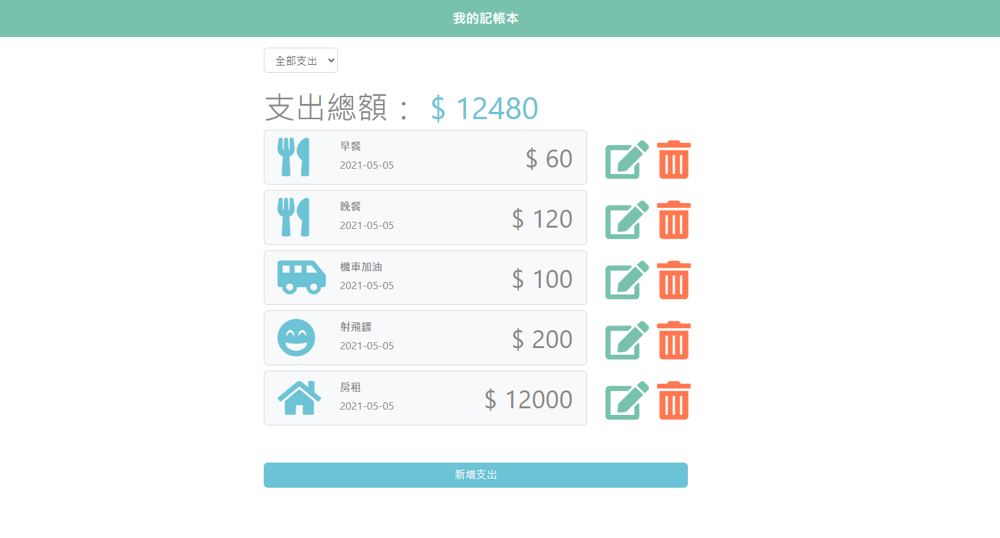

# Spending Tracker

透過 Node.js/ Express/ MongoDB/ Heroku 打造的網路記帳工具
作品連結：https://guarded-cliffs-96389.herokuapp.com/

## 預覽圖



## 功能介紹

使用者可以：

- 在首頁一次瀏覽所有支出
- 在首頁看到所有支出清單的總金額
- 新增一筆支出
- 編輯支出的屬性 (一次只能編輯一筆)
- 刪除任何一筆支出 (一次只能刪除一筆)
- 在首頁可以根據支出「類別」篩選支出，總金額的計算只會包括被篩選出來的支出總和

## 安裝版本

- Express v4.17.1
- Express-Handlebars v5.3.2
- Method-Override v3.0.0
- Mongoose v5.13.13


## 安裝步驟

1. 打開終端機 (Terminal) 輸入以下訊息，下載專案至本機

```
git clone https://github.com/reDawsonLin/spending-tracker.git
```

2. 進入專案目錄資料夾

```
cd spending-tracker
```

3. 安裝 npm 套件

```
npm install
```

4. 加入種子資料

```
npm run seed
```

5. 啟動伺服器來執行專案

```
npm run dev
```

6. 出現以下訊息即可打開瀏覽器輸入 http://localhost:3000 開始使用

```
App is running on http://localhost:3000
```
